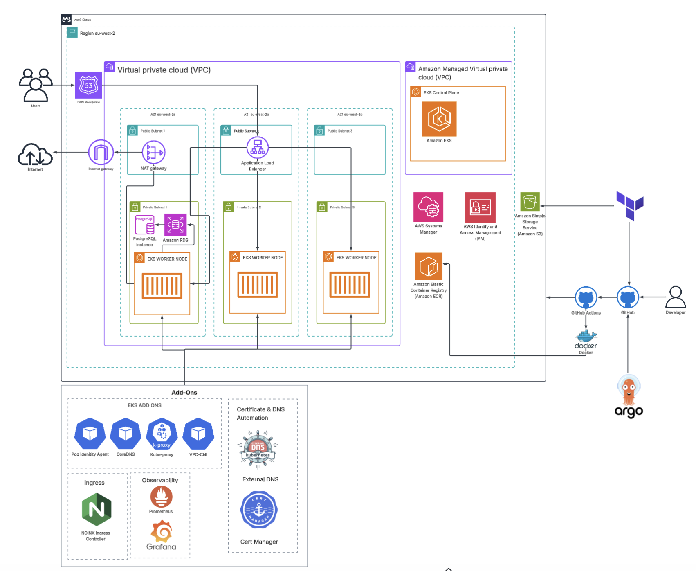
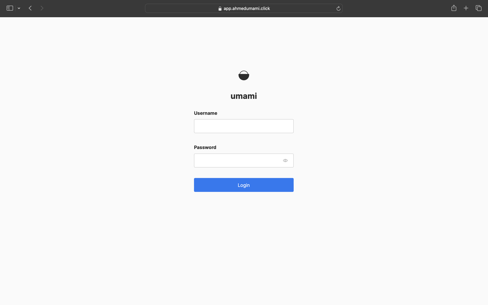
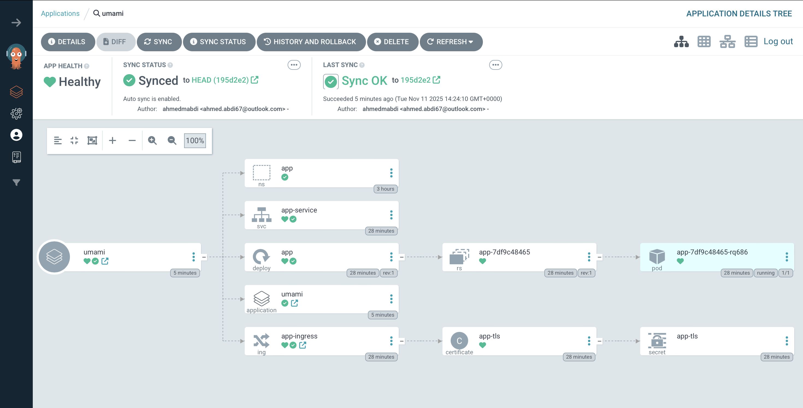
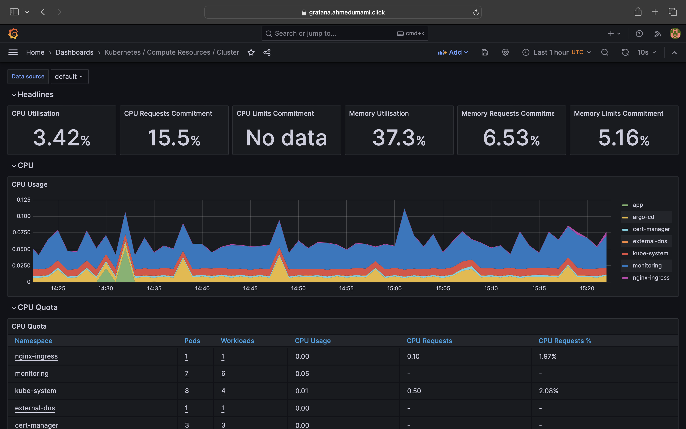
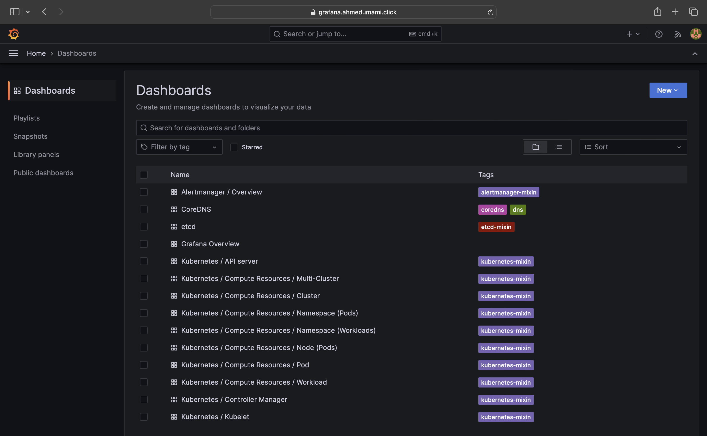
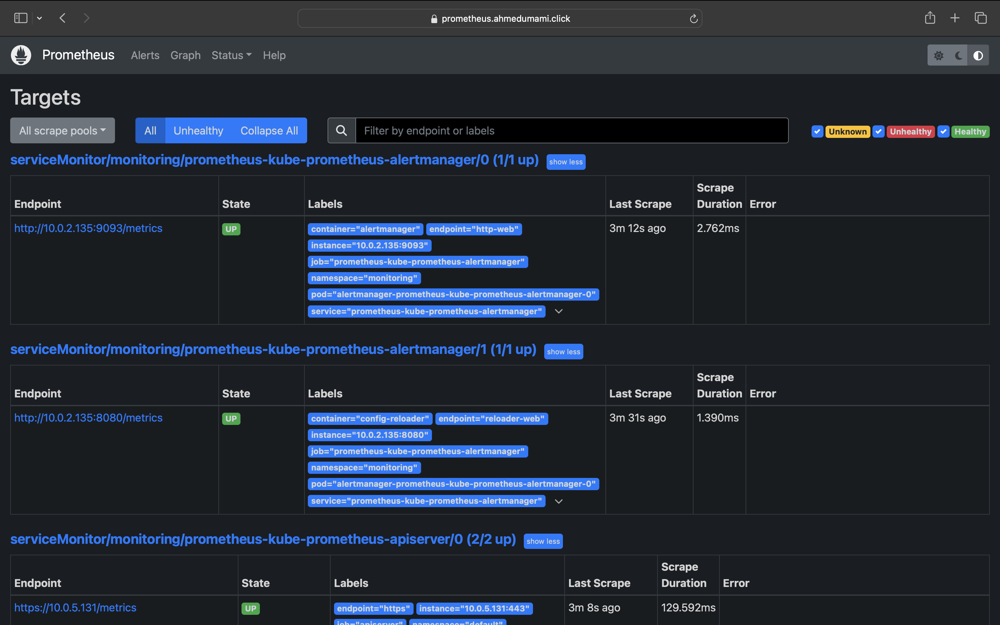
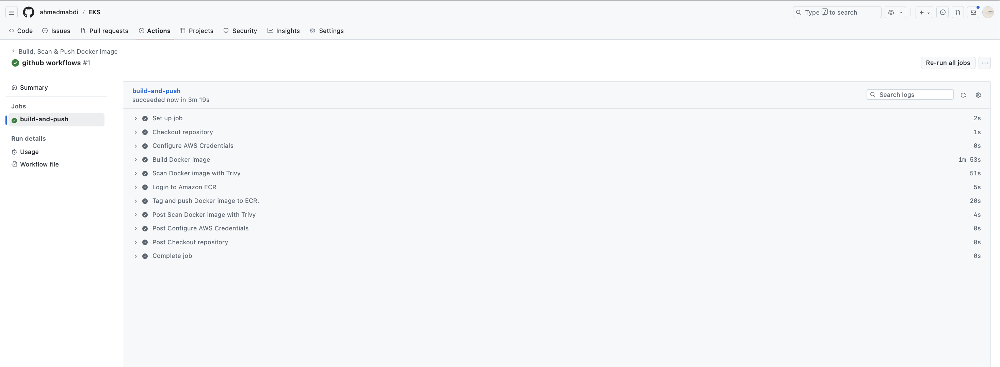
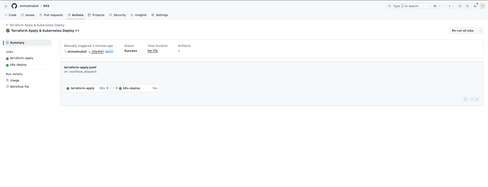

# EKS Deployment – Web Analytics Platform

This project deploys an **Amazon EKS environment** to host the **Umami web analytics** application with fully automated, scalable and secure infrastructure. The stack uses Terraform for end to end provisioning, ArgoCD for GitOps based application delivery and a complete observability suite for real time monitoring.

The solution integrates multiple AWS services including **ECR, RDS PostgreSQL, Route53 and IAM** to provide a modern, cost efficient and resilient platform for running a privacy focused analytics tool at scale. By combining Kubernetes best practices with GitOps workflows, the deployment supports continuous delivery, high availability across multiple Availability Zones and strong operational governance.

---

## Why Amazon EKS?

EKS was selected for its strong AWS integration and ability to run secure, scalable and Kubernetes native workloads.  
This deployment benefits from:

- Automated and highly available Kubernetes control plane  
- Secure pod networking using AWS VPC CNI  
- Pod Identity for fine-grained IAM access  
- Managed node groups for elasticity and resilience  
- GitOps workflows powered by ArgoCD  
- Centralized monitoring with Prometheus and Grafana  
- Native integrations with ECR, RDS, Route53 and other AWS services  

---

## Project Highlights

| Feature / Component            | Description |
|-------------------------------|-------------|
| **Infrastructure as Code**    | Full AWS environment provisioned using Terraform: VPC, subnets, EKS, node groups, RDS, IAM roles, Route53, Security Groups. |
| **Networking**                | 3 public + 3 private subnets across 3 AZs; Internet-facing AWS **ALB** for Ingress; single NAT Gateway for cost-optimized egress. |
| **EKS & Kubernetes**          | Amazon EKS cluster with managed node groups, VPC CNI, CoreDNS, Kube-Proxy, and Pod Identity enabled for secure AWS access. |
| **Helm Deployments**          | Helm used to install core cluster components: NGINX Ingress Controller, cert-manager, ExternalDNS, ArgoCD, Prometheus/Grafana. |
| **Application Delivery**      | ArgoCD manages GitOps deployment of the Umami application using Helm/K8s manifests stored in GitHub. |
| **CI/CD Pipeline**            | GitHub Actions builds Docker images, pushes to Amazon ECR, and triggers ArgoCD sync for automated app delivery. |
| **Database Layer**            | Amazon RDS PostgreSQL (private subnets) with secure SG rules, powered by SSM-managed credentials. |
| **DNS & Certificates**        | Route53 + ExternalDNS automate DNS updates; cert-manager issues TLS certificates via ClusterIssuer. |
| **Monitoring & Logging**      | Prometheus cluster metrics, alerting, and Grafana dashboards for observability. |
| **State Management**          | Terraform state stored in S3 backend with **native S3 state locking** for consistency and drift protection. |
| **Security Model**            | Pod Identity for role-based AWS access; least-privilege IAM; restricted SG rules; private subnets for RDS and workloads. |

> **Cost Controls:**  
> - Single NAT Gateway to reduce monthly cost while maintaining internet access for private workloads  
> - Single-AZ RDS instance for cost efficiency in non-production setups  
> - Minimal EKS managed node group with autoscaling for elasticity and savings  

---

## Architecture Diagram

 

---

## Screenshots

### Application UI

  

### ArgoCD Dashboard

  

### Monitoring Stack (Grafana/Prometheus)

 
  
  

---
## Debugging Log
Below is a concise summary of issues I encountered during the EKS deployment, their causes, solutions, and key lessons I learned for quick reference.

| Issue                         | Cause                                           | Solution                                                      | Lesson Learned                                   |
|-------------------------------|-------------------------------------------------|---------------------------------------------------------------|-------------------------------------------------|
| EKS CNI Not Ready / Addon CREATE_FAILED | Addons installed in wrong order; conflicting CRDs from auto-installed partial CNI | Delete failed addon, remove CRDs, clean leftovers, reinstall addon, recreate nodes | Always install VPC CNI before nodes; use `most_recent = true` for addons |
| Prometheus & Grafana Access Fail | Incorrect ClusterIssuer in ingress; missing DNS records | Fix ingress annotation; update DNS records; reapply Helm chart | Validate TLS issuers and DNS early              |
| Argo CD Service “Not Connected” UI Issue | Visualization limitation—Service selects Pods, no ownerReferences to Deployment | Verified labels & endpoints; no fix needed                    | Use `kubectl get endpoints` to confirm Service routing |
| Certificate Not Issued on EKS | Certificate resource created before Issuer fully reconciled; stale ACME challenges; cert-manager controller delayed reconciliation | Delete stuck CertificateRequest & ACME Challenge, restart cert-manager deployment, monitor Certificate status | In future deployments use `depends_on` in Terraform for Certificate → Issuer; split apply stages: cert-manager+Issuer first, then Certificates |

---

## CI/CD Workflows
This project includes fully automated CI/CD pipelines that handle image builds, infrastructure deployment, and continuous delivery to the EKS cluster.

- **Build & Push Container Images**

    

- **Terraform Plan & Apply**

    

---

## Future Improvements

Planned enhancements for production environments based on the AWS Well-Architected Framework pillars:

### Security
- Add **AWS WAF** in front of the ALB/Ingress to protect against common web exploits  
- Integrate **AWS Secrets Manager** for centralized, rotation-capable secret storage  
- Enable **GuardDuty**, **Security Hub**, and **Inspector** for continuous security posture monitoring  
- Enforce **private ECR access** using VPC endpoints for isolation  

### Reliability
- Upgrade RDS to **Multi-AZ** for improved fault tolerance and automatic failover  
- Deploy **NAT Gateways in each AZ** to prevent single-AZ dependency  
- Add **Cluster Autoscaler** + **HPA** for application and infrastructure-level scaling  

### Performance Efficiency
- Enable **horizontal scaling** for Umami to support load spikes  
- Configure **RDS Performance Insights** for query-level optimization  

### Cost Optimization
- Move logs/metrics to **Amazon Managed Prometheus/Grafana** to reduce in-cluster resource usage  
- Optimize storage with **gp3 volumes** for EKS and RDS  

### Operational Excellence
- Implement **Centralized logging** using OpenSearch or CloudWatch Logs with structured output  
- Add **Blue/Green or Canary deployments** using Argo Rollouts  

